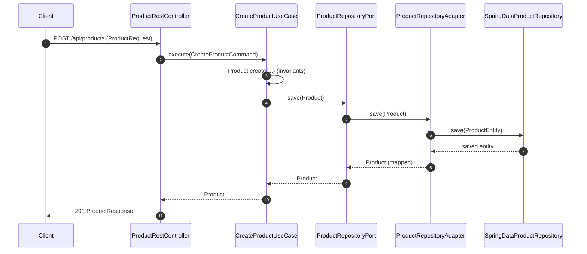
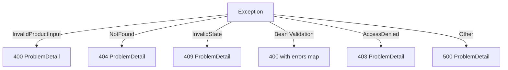
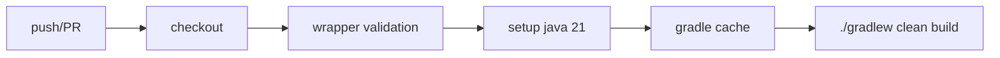

# DAY 3 COMPLETE — Clean Architecture Transition (Port/Adapter + Use-Case SRP + Domain Invariants)

**Date**: 2026-02-02  
**Scope**: Architectural Deep-Dive & Clean Architecture Refactor  
**Result**: Controllers decoupled from repositories, domain model made framework-agnostic, and CI stabilized.

---

## 1) Executive Summary

Day 3 moved the project from a “Spring MVC/REST + JPA repository at the edge” style into a **Clean Architecture** shape:

- **Domain**: Pure business objects + invariants + business rules (no Spring/JPA).  
- **Application**: Use-cases (SRP) orchestrate domain + transactions via **ports**.  
- **Infrastructure**: Adapters implement ports using Spring Data JPA + mapping.  
- **Interfaces**: REST/MVC controllers only deal with DTOs and commands, not persistence.

Also, CI/CD was split to keep builds green regardless of deployment secrets.

---

## 2) Goals (Day 3)

### Must-have
- ✅ Controllers **must not** depend on Spring Data repositories directly.
- ✅ Domain model **must not** include framework annotations or infra concerns (e.g., timestamps).
- ✅ Use-cases follow **SRP** (Create/Update/Delete/List separated).
- ✅ Port/Adapter pattern breaks infrastructure coupling.
- ✅ Transaction boundaries defined in application layer (`@Transactional`, readOnly where appropriate).
- ✅ Domain exceptions mapped to correct HTTP statuses (400/404/409) in RFC7807 ProblemDetail format.
- ✅ CI pipeline green: build + test + cache + wrapper validation.

### Nice-to-have
- ✅ Testcontainers integration test using `@ServiceConnection`.
- ✅ Simple domain unit tests for invariants / business rules.

---

## 3) Architecture Snapshot

### 3.1 Package Structure (Logical)

```text
domain/
  model/        -> Product, ProductStatus (PURE)
  exception/    -> InvalidProductInputException, InvalidProductStateException, ProductNotFoundException

application/
  port/         -> ProductRepositoryPort
  command/      -> CreateProductCommand, UpdateProductCommand, DeleteProductCommand
  usecase/      -> Create/Update/Delete/List/Get use-cases (SRP)

infrastructure/
  persistence/
    entity/     -> ProductEntity (JPA), UserEntity (JPA)
    repository/ -> SpringDataProductRepository
    adapter/    -> ProductRepositoryAdapter, ProductMapper

interfaces/
  web/
    rest/       -> ProductRestController, AuthRestController
    mvc/        -> ProductMvcController, HomeMvcController
  exception/    -> GlobalExceptionHandler (ProblemDetail)
```

### 3.2 “Before vs After” dependency direction

```mermaid
flowchart LR
  subgraph Before["Day 2 - Before"]
    C1[Controller] --> R1[SpringData Repository]
    R1 --> E1[JPA Entity]
  end

  subgraph After["Day 3 - After"]
    C2[Controller] --> UC[Use-Case]
    UC --> P[Repository Port]
    P --> A[Adapter (JPA)]
    A --> R2[SpringData Repository]
    A <--> M[Mapper]
    M <--> D[Domain Model]
    R2 --> E2[JPA Entity]
  end
```

---

## 4) Decision Log (ADR Index)

| ADR | Title | Status |
|---:|---|---|
| 001 | Clean Architecture Baseline | Accepted |
| 002 | Dual Authentication (JWT + Form Login) | Accepted |
| **003** | **Use-Case SRP + Port/Adapter + Domain Invariants** | **Accepted (Day 3)** |

> ADR-003 is located under `doc/adr/003-usecase-ports-domain-invariants.md`.

---

## 5) Key Decisions & Trade-offs

### 5.1 Use-cases return **Domain**, not DTO
**Decision**: Use-cases return `Product` (domain), controllers map to DTOs.  
**Why**: Dependency rule — application layer cannot depend on interfaces layer types.  
**Trade-off**: Slightly more mapping in controllers (intentional & explicit).

### 5.2 Port/Adapter around persistence
**Decision**: Use-cases depend on `ProductRepositoryPort`, not `SpringDataProductRepository`.  
**Why**: Swap persistence tech later; test use-cases with mocks; isolate JPA.  
**Trade-off**: Extra adapter + mapper code (small price for boundary clarity).

### 5.3 Domain invariants via factory methods
**Decision**: `Product.create(...)` and `Product.reconstruct(...)` enforce invariants; no public constructor.  
**Why**: Prevent invalid state creation; invariants cannot be forgotten.  
**Trade-off**: Slightly more ceremony, massively better correctness.

### 5.4 Timestamps remain infrastructure concern
**Decision**: `createdAt/updatedAt` stay in JPA entity via lifecycle callbacks, NOT in domain.  
**Why**: Keeps domain pure; timestamps are persistence concerns.  
**Trade-off**: DTOs that need timestamps must map from entity or separate projection.

### 5.5 Transactions at use-case boundary
**Decision**: `@Transactional` at use-case methods; queries `readOnly=true`.  
**Why**: Use-case is the business transaction boundary.  
**Trade-off**: Requires discipline — controllers must not open transactions.

---

## 6) Runtime Flow (REST + MVC)

### 6.1 REST Create Flow



### 6.2 MVC CRUD Flow (same use-cases)
MVC controller uses the same use-cases, but responds with redirects + flash messages.

---

## 7) Error Handling Standard (ProblemDetail)

### Exception → HTTP mapping
- `InvalidProductInputException` → **400 BAD_REQUEST**
- `ProductNotFoundException` → **404 NOT_FOUND**
- `InvalidProductStateException` → **409 CONFLICT**
- Validation errors (`MethodArgumentNotValidException`) → **400** with field map
- `AccessDeniedException` → **403 FORBIDDEN**
- Fallback → **500 INTERNAL_SERVER_ERROR**



---

## 8) CI/CD Changes (Reliability First)

### 8.1 CI workflow (always green)
- Build + test run on push/PR
- Wrapper validation for supply-chain safety
- Gradle caching for faster feedback



### 8.2 Deploy workflow (manual)
Deploy is `workflow_dispatch` to avoid failing due to missing server secrets during development.

---

## 9) Verification & DoD (Definition of Done)

### Automated
- ✅ `./gradlew clean build` passes locally
- ✅ Unit tests cover domain invariants (min: create/reconstruct/rename/updatePrice/adjustStock/changeStatus)
- ✅ Integration test runs with Testcontainers (login → get products OR minimal happy path)

### Manual
- ✅ Admin login → create/edit/delete from UI works
- ✅ User login → read-only UI (no admin actions)
- ✅ Swagger reachable
- ✅ `/actuator/health` ok
- ✅ Error responses in ProblemDetail format

---

## 10) What We Deliberately Did NOT Do (Yet)

- ❌ Full-blown DDD aggregates/events (overkill for this stage)
- ❌ CQRS or separate read models
- ❌ Heavy “service layer” inside domain (kept simple)
- ❌ Automated server deployment by default (kept manual until secrets & infra stable)

---

## 11) Next Steps (Day 4 Ideas)

- Increase test coverage (controller negative cases + security integration tests)
- Add ADR for “timestamps strategy” if DTOs require them consistently
- Decide if `ProductResponse` should include timestamps via projection or entity mapping
- If ready: enable deploy workflow after secrets + infra verified

---

## Appendix A — Quick Layer Rules

- **Domain**: No Spring, no JPA, no HTTP
- **Application**: Use-cases + ports; transaction boundaries
- **Infrastructure**: JPA entities, repositories, adapters, mapping
- **Interfaces**: DTOs, controllers, views; mapping only
