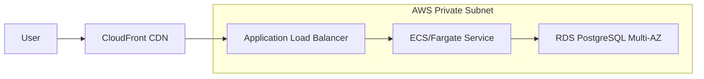

# 🚀 Deployment & Operations Guide

## 🏗️ Production Topology



---

## 🐳 Containerization

The application uses a **Multi-Stage Dockerfile** to minimize the attack surface and image size.

> [!NOTE]
> **Security Tip**: The runtime image uses `eclipse-temurin:21-jre-alpine` and runs as a non-privileged `spring` user.

### Local Build & Run
```bash
docker build -t catalog-app:latest .
docker run -p 8080:8080 --env-file .env catalog-app:latest
```

---

## 🔄 CI/CD Pipeline (GitHub Actions)

Our pipeline is designed for "Continuous Delivery" with automated quality gates.

| Gate | Tool | Purpose |
| :--- | :--- | :--- |
| **Lint** | Checkstyle | Code style consistency |
| **Unit Test** | JUnit 5 | Logic verification |
| **Security Scan** | Trivy | Image vulnerability check |
| **Integration** | Testcontainers | Real DB behavior verification |

---

## 🛠️ Environment Variables Configuration

| Variable | Default | Description |
| :--- | :--- | :--- |
| `DB_URL` | `jdbc:postgresql://localhost:5432/catalogdb` | JDBC Connection String |
| `JWT_SECRET` | `CHANGE_ME...` | **CRITICAL**: Minimum 32 chars |
| `SPRING_PROFILES_ACTIVE` | `dev` | Profile for config overrides |
| `DATA_SEEDING_ENABLED` | `true` | Set to `false` in Prod |

---

## 🏥 Troubleshooting Playbook

### 1. Database Connectivity Issues
**Symptom**: `HikariPool-1 - Connection is not available`  
**Check**: 
- Verify Security Groups allow port 5432.
- Check if DB credentials in AWS Secrets Manager match `.env`.

### 2. JWT Validation Failures
**Symptom**: API returns 401 even with correct token.  
**Check**: 
- Ensure `JWT_ISSUER` environment variable matches exactly between token and app config.
