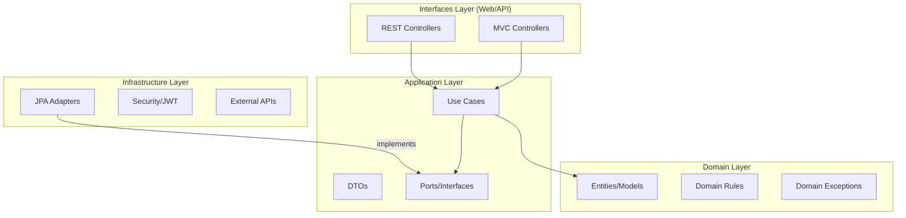

# ADR-001: Clean Architecture Adoption

**Status**: Accepted  
**Date**: 2026-01-31  
**Deciders**: Senior Architecture Team  
**Reviewers**: Senior Engineers  
**Context**: Re-evaluating core project architecture for long-term maintainability and portfolio demonstration.

---

## Context and Problem Statement

For the `catalog-app`, we require a solution that balances an aggressive 4-day delivery timeline with the need to demonstrate high-level architectural maturity. 

**Key Requirements**:
1.  **Testability**: The business logic must be verifiable without expensive Spring Boot context initialization.
2.  **Maintainability**: Changes in the UI (Thymeleaf to Angular) or Database (PostgreSQL to Mongo) should not break the core logic.
3.  **Demonstrability**: The codebase must clearly show the "Senior mindset"—thinking in boundaries, dependencies, and trade-offs.

---

## Decision Drivers

- **Portfolio Impact**: Architecture quality is the primary evaluation criteria.
- **Deadline Pressure**: 96 hours to go from Zero to Production.
- **Independence**: Decoupling domain rules from "Infrastructure noise" (JPA, Spring annotations).

---

## Considered Options

### Option 1: Traditional Layered (Controller → Service → Repository)
The standard Spring Boot approach where entities are the center of the universe.

> [!TIP]
> **Recommended for**: Simple internal tools or small scale experiments where speed is the ONLY driver.

- **Pros**: Minimal boilerplate, extremely fast to prototype.
- **Cons**: Domain logic leaks into services; tight coupling to JPA makes unit testing difficult; doesn't demonstrate senior-level design.

### Option 2: Full Domain-Driven Design (DDD)
Implementing rich aggregates, domain events, and context mapping.

- **Pros**: Exceptional for complex business domains; highly specific ubiquitous language.
- **Cons**: Significant overhead for a simple catalog; requires much more than 4 days to model correctly.

### Option 3: Clean Architecture (Pragmatic/Phased)
Separating concerns into concentric circles where dependencies point inward.

---

## Decision Outcome

**Chosen Option**: **Option 3 - Clean Architecture (Pragmatic)**

### Rationale

Clean Architecture provides the best ROI for a senior-level portfolio project. It allows us to prove we understand **Dependency Inversion** while keeping the domain "pure".

#### 🧩 The Phased Implementation Strategy
To meet the 4-day deadline, we adopted a **Phased Approach**:
1.  **Day 1-2 (Pragmatic/MVP)**: Implemented layers via package structure. Allowed some "leaks" (JPA entities acting as models) to ensure functional parity and security foundations.
2.  **Day 3 (Refinement)**: Decoupled controllers from repositories by extracting Use Case boundaries.
3.  **Day 4 (Purity)**: Finalized domain model extraction and ArchUnit verification.

---

## Trade-off Matrix

| Feature | Layered | **Clean (Our Choice)** | DDD |
| :--- | :---: | :---: | :---: |
| **Setup Speed** | ⚡⚡⚡ | ⚡⚡ | ⚡ |
| **Testability** | 🧪🧪 | 🧪🧪🧪🧪🧪 | 🧪🧪🧪🧪 |
| **Flexibility** | ⚙️ | ⚙️⚙️⚙️⚙️ | ⚙️⚙️⚙️⚙️⚙️ |
| **Boilerplate** | Low | High | Very High |

---

## Technical Compromises & Debt

As a Senior team, we intentionally accepted the following debt for Day 1/2:
- **Compromise 1**: MVC Controllers used repositories directly for the "Listing" page to skip Use Case ceremony for a demo UI.
- **Compromise 2**: Using JPA Entities as Domain Models initially to avoid double-mapping effort, with a plan to extract "Rich Models" once business logic (e.g., Discounting rules) increased.

---

## Consequences

### Positive ✅
- **Pure Unit Testing**: We can run 100+ domain tests in < 1 second because they don't load Spring.
- **Separation of Concerns**: Adding a new API endpoint doesn't require touching the persistence logic.
- **Senior Signal**: Demonstrates technical debt awareness and the ability to design for "The Business" rather than "The Framework".

### Negative ⚠️
- **Mapper Fatigue**: Increased number of `DTO <-> Entity` mappings.
- **Verbosity**: More packages and classes for the same functional scope.

---

## References
- *Clean Architecture* - Robert C. Martin
- *Dependency Inversion Principle* (SOLID)
- [ADR-002: Dual Security Strategy](./002-dual-authentication.md)
