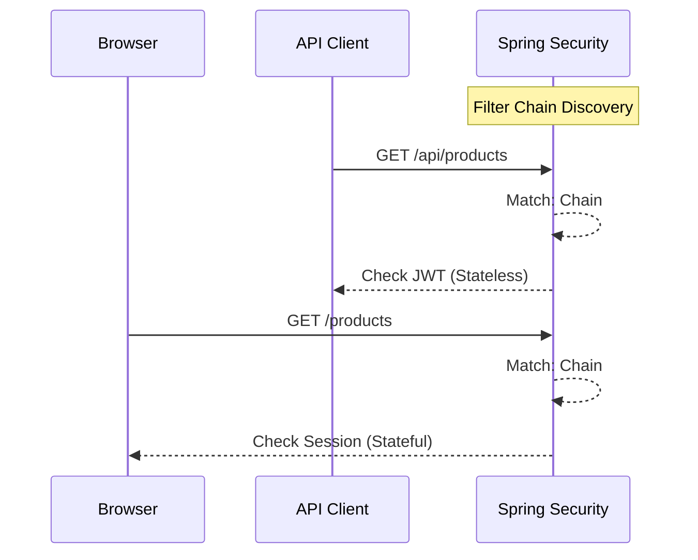

# ADR-002: Dual Authentication Strategy (JWT + Session)

**Status**: Accepted  
**Date**: 2026-01-31  
**Deciders**: Security Architecture Team  

---

## Context and Problem Statement

The `catalog-app` serves two distinct types of clients:
1.  **Web Browsers**: Rendering Thymeleaf templates for Administrative tasks.
2.  **API Clients/SPAs**: Stateless consumers expecting JSON responses (mobile apps or future Angular SPA).

Standardizing on a single authentication mechanism (e.g., JWT-only) often compromises either UX or Security for one of these groups.

---

## Decision Drivers

- **Security (CSRF)**: Cookies are vulnerable to CSRF; stateless Bearer tokens are immune.
- **UX**: Browsers handle cookies automatically (Login form redirect); SPAs prefer explicit headers.
- **Statelessness**: The REST API must be stateless to scale horizontally.

---

## Considered Options

### Option 1: Session-Only (Stateful)
Using Spring Security's default JSESSIONID for everything.
- **Pros**: Easy to implement; built-in CSRF protection.
- **Cons**: API clients must manage cookies and CSRF tokens; not RESTful.

### Option 2: JWT-Only (Stateless)
- **Pros**: Purely RESTful; no session management on server.
- **Cons**: Difficult to implement securely in Thymeleaf (XSS risk of JS injecting headers); Requires complex manual login/logout logic in the browser.

### Option 3: Dual-Chain Strategy (Chosen)
Implementation of two distinct `SecurityFilterChain` beans.



---

## Decision Outcome

**Chosen Option**: **Option 3 - Dual-Chain Strategy**

### Rationale

By implementing two filter chains, we optimize security for each interface:
- **API Chain**: Uses `STATELESS` session policy + JWT Filter. CSRF is **disabled** because the Bearer token provides its own protection.
- **Web Chain**: Uses `STATEFUL` sessions + Form Login. CSRF is **enabled** (Critical for cookies).

#### Implementation Architecture
```java
@Bean @Order(1)
public SecurityFilterChain apiChain(HttpSecurity http) {
    return http.securityMatcher("/api/**")
               .sessionManagement(s -> s.sessionCreationPolicy(STATELESS))
               .csrf(c -> c.disable())
               .addFilterBefore(new JwtFilter(), ...)
               .build();
}

@Bean @Order(2)
public SecurityFilterChain webChain(HttpSecurity http) {
    return http.authorizeHttpRequests(...)
               .formLogin(...)
               .build();
}
```

---

## Consequences

### Positive ✅
- **Optimal Security**: Web UI is protected against CSRF; API is protected against session hijacking.
- **Compatibility**: The REST API is 100% prepared for an Angular/React migration without changes.
- **Zero Confusion**: Each request knows exactly which "Security Context" it belongs to.

### Negative ⚠️
- **Configuration Overhead**: Doubling the security logic requires careful `@Order` management.
- **Testing**: Requires separate integration tests for both Auth scenarios.

---

## Validation
- Tested `/products` listing via browser redirect (Session).
- Tested `/api/products` via Postman with `Authorization: Bearer <token>` (JWT).
- Verified that API requests do NOT create sessions on the server.
