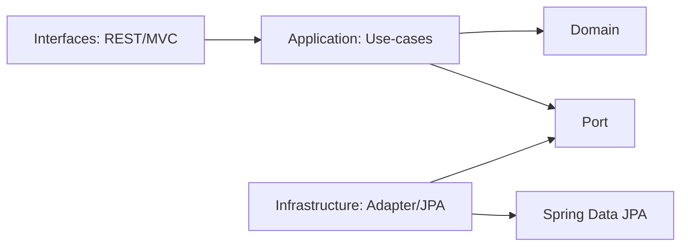

# ADR-003 — Use-Case SRP + Port/Adapter + Domain Invariants

**Status**: Accepted  
**Date**: 2026-02-02  
**Decision Drivers**:
- Enforce Clean Architecture dependency direction
- Improve testability and long-term maintainability
- Prevent entity leakage and invalid domain states
- Keep CI green even when deployment secrets/infra are incomplete

---

## Context

Day 2 delivered working REST + MVC with security. However:
- Controllers and MVC flow were at risk of depending on persistence details.
- Domain logic was at risk of being split across controllers/entities.
- CI failures could occur due to deploy secrets.

We want a structure that is portfolio-grade and production-ready, with clear boundaries.

---

## Decision

### 1) Use-cases are SRP and return domain objects
We implement individual use-cases:
- `ListProductsUseCase` (readOnly transaction)
- `CreateProductUseCase`
- `UpdateProductUseCase`
- `DeleteProductUseCase`
- `GetProductUseCase`

Use-cases return **`Product` (domain)** rather than REST/MVC DTOs.

### 2) Persistence is accessed via a Port, implemented by an Adapter
Application layer depends on:
- `ProductRepositoryPort`

Infrastructure layer implements:
- `ProductRepositoryAdapter` wrapping Spring Data JPA

Mapping between domain and JPA entity is handled by:
- `ProductMapper`

### 3) Domain invariants are enforced by factories
- `Product.create(...)` validates invariants for new products.
- `Product.reconstruct(...)` is used for loading existing products.
No public constructor is available.

### 4) Domain errors are explicit and mapped to HTTP in the interface layer
- `InvalidProductInputException` → 400
- `ProductNotFoundException` → 404
- `InvalidProductStateException` → 409

### 5) CI and deploy are separated
- `ci.yml` always runs and must stay green.
- `deploy.yml` becomes manual (`workflow_dispatch`) until secrets/infra are stable.

---

## Consequences

### Positive
- Clear layer boundaries; controllers don't touch repositories.
- Domain stays framework-agnostic and testable.
- Port/Adapter supports future persistence swaps.
- SRP use-cases are smaller, easier to test and reason about.
- CI stability improves, reducing noise and risk.

### Negative / Trade-offs
- More files (commands, ports, adapter, mapper).
- Mapping code is manual (but explicit and maintainable).
- Some DTOs may need extra mapping if timestamps are required (timestamps remain in Entity).

---

## Alternatives Considered

### A) Single “ManageProductUseCase”
Rejected due to “God object” risk and testing complexity.

### B) Keep JPA entity as domain model
Rejected: would leak persistence annotations and lifecycle concerns into domain.

### C) Return DTOs from use-cases
Rejected: violates dependency direction (application depending on interfaces).

---

## Diagrams

### Dependency direction

---

## Action Items
- Keep adding invariants and rules inside `Product` as requirements grow.
- Add more integration tests (negative scenarios + security).
- When deployment is stable, convert deploy workflow to run after CI with required secrets.
